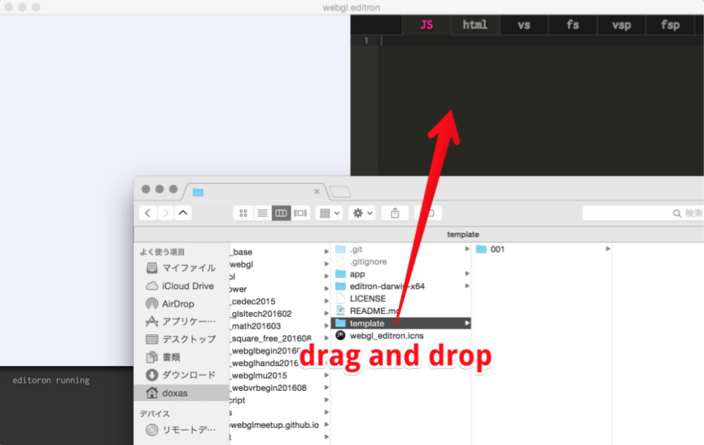
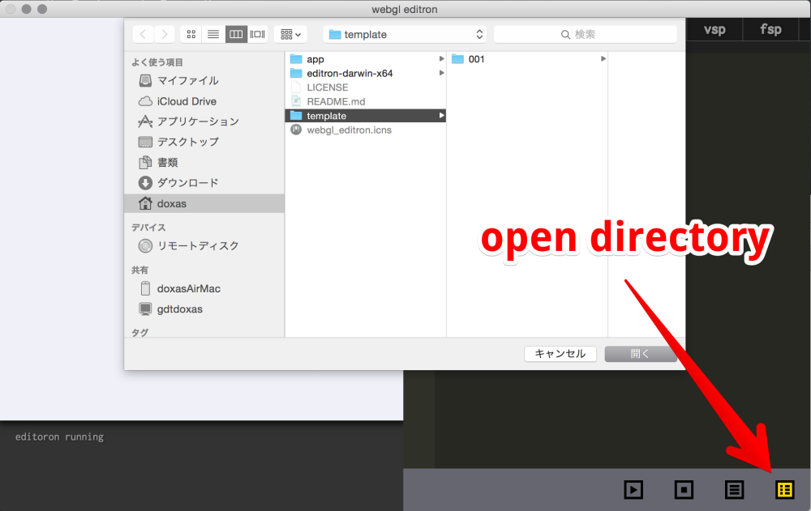
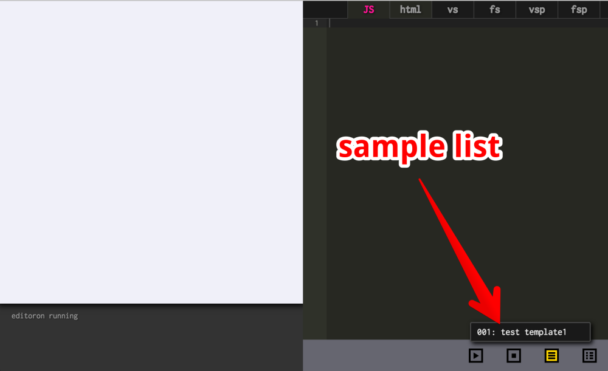
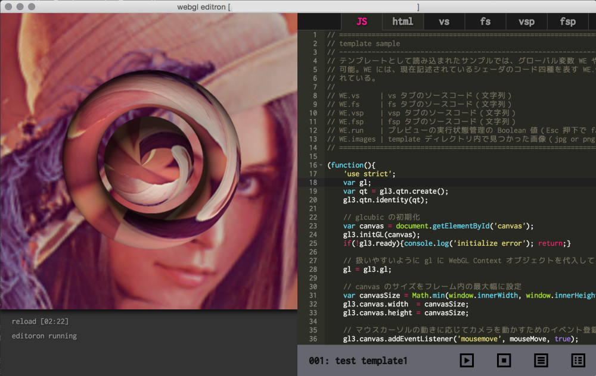

# webgl editron

webgl editor app for electron.


## about

template をディレクトリごと読み込んで Electron で表示できる WebGL エディタ。

HTML と JavaScript、さらに頂点シェーダとフラグメントシェーダを編集可能で、保存すると同時にプレビューが更新される。

シェーダは頂点シェーダとフラグメントシェーダを 2 セット同時に読み込む。

二組同時にシェーダを読み込めるので、ポストプロセスなどを実行可能。


## template

以下、ディレクトリ構成の例。

```
template
├── 001
│    ├ html.html     | プレビューされる HTML
│    ├ javascript.js | プレビュー実行される JS
│    ├ vs.vert       | 頂点シェーダ（その１）
│    ├ fs.frag       | フラグメントシェーダ（その１）
│    ├ vsp.vert      | 頂点シェーダ（その２）
│    ├ fsp.frag      | フラグメントシェーダ（その２）
│    └ info.json     | このテンプレートのインフォメーション
├── 002
│    ├ html.html
│    ├ javascript.js
│    ├ vs.vert
│    ├ fs.frag
│    ├ vsp.vert
│    ├ fsp.frag
│    └ info.json
├── 003
├── 004
└── ... 以下つづく
```

`info.json` には、そのテンプレートのタイトルなどを記載する。これをベースに、エディタ上でサンプルの名前が表示される。

以下その書式。

```
{
    "title": "template name",
    "version": "0.0.0",
    "author": "author name",
    "description": "template description"
}
```

なお現状は上記全てのファイルが揃っていないと読み込めない仕様。

また、各テンプレートのディレクトリ名も三桁数字で現状は固定。このテンプレートディレクトリの中に画像（JPG or PNG）突っ込んでおくと、プレビュー実行時に渡してテクスチャなどに利用できる。（optional）

テンプレートを作るときは、上記のような、三桁数字のディレクトリが連番で入っている形にする。

テンプレートが実行される際、javascript では `WE` という名前のグローバル変数を参照でき、この中に、エディタ上で編集したシェーダのソースコード、親ウィンドウのインスタンス、親ウィンドウ側で読み込んだ画像のセットなどが含まれる。


## editor

エディタ実装部分は Ace Editor を拝借。

JS、Coffee、TypeScript、CSS、HTML、JSON などはシンタックスハイライトが効くはず。

ショートカットなどはいろいろあるので有志のドキュメント参照。

> [Default Keyboard Shortcuts · ajaxorg/ace Wiki](https://github.com/ajaxorg/ace/wiki/Default-Keyboard-Shortcuts)

また、本アプリケーション独自のカスタムショートカットは以下。

| キー             | 機能                 |
|------------------|----------------------|
| Esc              | プレビュー実行停止   |
| Ctrl + s         | 保存＋プレビュー実行 |
| Ctrl + plus      | 文字サイズ大きく     |
| Ctrl + hyphen    | 文字サイズ小さく     |
| Alt + /          | テーマ明暗切り替え   |
| Ctrl + Shift + i | 開発者ツールの表示   |

※Mac の場合は Ctrl の代わりに Command を使用

なお、明暗切り替え機能があるのはユーザーの趣向を考慮してのことではなく、プロジェクター等でプレゼンテーションやハンズオンを行う際に、黒背景だと特に赤い文字などが滲んで非常に見えにくくなることがあるためで、明るい背景であれば見えにくくなりにくい。

文字列を大きくできるのも、上記と同じ理由である。

また、Electron で実行されるため、開発者ツールが見れない場合デバッグが非常にやりにくくなるので、ショートカットキーは覚えておくとよい。


## how to use

ディレクトリを開く際は、ボタンからダイアログを呼び出してディレクトリを開く、あるいは対象のテンプレートディレクトリをドラッグ・アンド・ドロップする。





テンプレートを読み込むと、ウィンドウ下部のボタンからテンプレートリストが表示できるようになり、これをクリックで選択するとテンプレートが読み込まれる。



あとは、Ctrl + s（Mac なら Command + s）でその時点でのソースコードが左側のプレビューペインで実行される。このとき、同時にローカルファイルが保存される。

Esc キーを押下することにより、プレビューの実行を停止することができる。



なお、プレビューの実行と停止は、ウィンドウ下部のボタンからも行うことができる。


## pack

```
# mac での例
electron-packager ./app editron --platform=darwin --arch=x64 --version=1.3.4 --icon=webgl_editron.icns

# win での例
electron-packager app editron --platform=win32 --arch=x64 --version=1.3.4 --icon=icon_win_256x256.ico

いずれの場合も、Electron のバージョンやアイコンデータを置く階層などに注意。要 electron-packager。
```


## license

This software is released under the MIT License.

