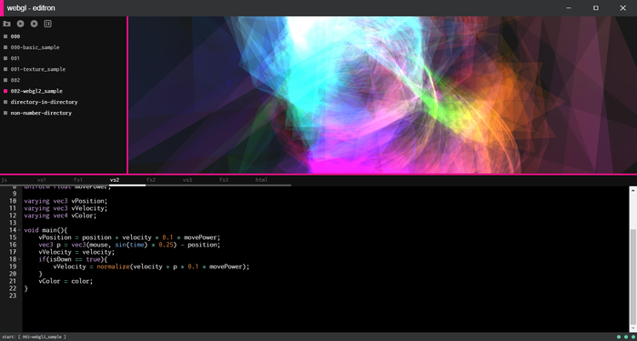
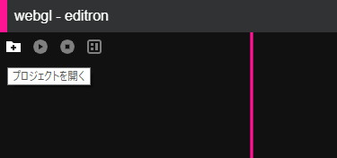
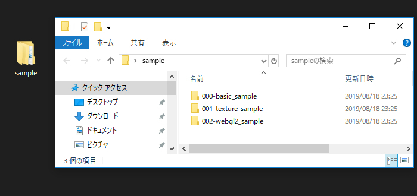
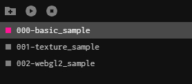
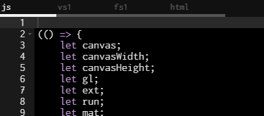

# webgl editron

WebGL and GLSL live editor app for electron.

## development

```
$ npm install
$ npm start
```

## package

```
# for windows
$ npm run package:win

# for macos
$ npm run package:mac
```

## release build

[Releases · doxas/webgl\_editron](https://github.com/doxas/webgl_editron/releases)

## how to use

ローカルにある HTML + CSS + JavaScript で記述されたプロジェクトを開いて、編集および実行が行える WebGL の実行環境を提供するエディタです。

同時に GLSL ファイル（ `*.vert` or `*.frag` ）を開いて編集することができ、ショートカットキーや実行ボタンからリアルタイムにファイルを編集・実行します。

内部的には Electron のメインプロセス側でローカルサーバを起動してファイルを iframe で開いている形になっており、Chrome と同様の開発者ツールでのデバッグ作業などを行うこともできます。



画面左上にある、フォルダ＋プラス記号のアイコンをクリックすると、ディレクトリを開くためのダイアログが表示されます。

ディレクトリには、後述する「ファイル構成」に沿って、あらかじめ HTML ファイルや JavaScript のファイル、シェーダを記述したファイルなどを配置しておきます。





基本的に、プロジェクト内のディレクトリ名は任意ですが、文字列としてソートされてからエディタに並ぶことになるため、順番に意味を持たせたい場合はディレクトリ名の冒頭に数値を入れるなどする必要があります。

プロジェクトが読み込まれると、画面の左側に読み込まれたディレクトリが並びます。



プロジェクト内の任意のディレクトリ名をクリックすると、そのソースコードがエディタ上に展開されます。

このとき、同時にビューも更新され、JavaScript が実行された結果が表示されます。



## project template

プロジェクトは、複数のディレクトリから構成されます。

各ディレクトリ内は、以下に示したルールに沿ってファイルが配置されている必要があります。

```
project-directory
  ├ index.html ※必須
  ├ script.js  ※必須
  ├ vs1.vert
  ├ fs1.frag
  ├ etc...
```

ディレクトリ内のファイルは、自動的に内部で起動されるローカルサーバによってプレビューされます。このとき、最低限 HTML ファイルと JavaScript ファイルが必要となるため、このふたつのファイルは必須です。

これ以外に `vs[n].vert` や `fs[n].frag` という命名規則のファイルがある場合、シェーダファイルとしてエディタ上に読み込まれ、編集が可能になります。

また、画像や CSS ファイル、任意の JSON ファイルなどをディレクトリ内に含めるのは自由にできますが「エディタ上で編集可能なファイルとして読み込む」ということはできません。エディタ上で編集可能なファイルとして認識されるのは、あくまでも `index.html` , `script.js` , `vs[n].vert` , `fs[n].frag` に限られます。

※実行時はローカルサーバが起動しているので JavaScript で `fetch` などを使ってファイルを参照することには制限はありません。

## editor

プロジェクトが読み込まれている状態で、任意のディレクトリを選択した状態になると、エディタ上にコードが展開され編集が可能になります。

編集したコードは、画面左上にある「再生ボタン」をクリックするか、エディタ上で `Ctrl + s` もしくは `Command + s` された際に自動的に保存が行われます。ファイルが保存されたあと、プレビューも自動的に更新されます。

ファイルの保存は、エディタに展開されている HTML や JavaScript の各種コードに対して、一斉にまとめて（すべてのファイルに対して）行われます。

## shortcut key

| キー             | 機能                     |
|------------------|--------------------------|
| Ctrl + s         | 保存＋プレビュー実行     |
| Ctrl + plus      | 文字サイズ大きく         |
| Ctrl + hyphen    | 文字サイズ小さく         |
| Ctrl + Shift + i | 開発者ツールの表示       |
| F11              | フルスクリーンモード     |
| Ctrl + Alt + b   | テーマ明暗切り替え       |
| Ctrl + Alt + v   | vim キーバインド切り替え |

※Mac の場合は Ctrl の代わりに Command を使用

## LICENSE

MIT.


