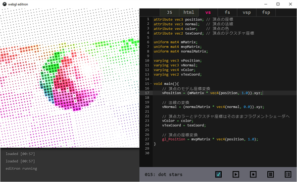
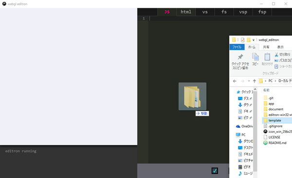
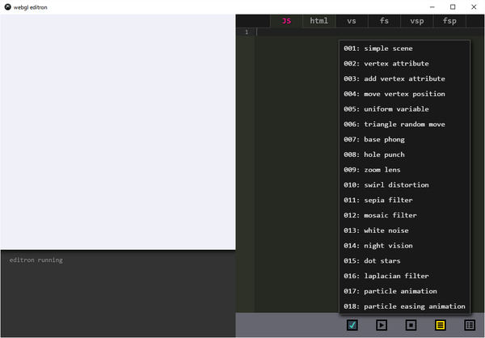
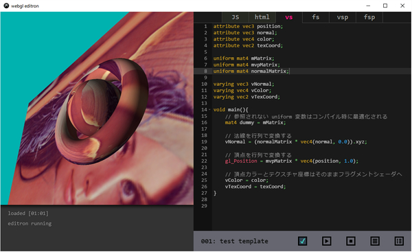

# webgl editron

webgl and GLSL live editor app for electron.



## about

あらかじめ一連のファイルをセットにして格納した template を、ディレクトリごと読み込んで Electron で表示できる WebGL 製のエディタです。

HTML と JavaScript、さらに頂点シェーダとフラグメントシェーダを編集可能で、保存すると同時にプレビューが更新される仕組みになっています。

シェーダは頂点シェーダとフラグメントシェーダを *2 セット* 同時に読み込み・編集が可能です。二組同時にシェーダを読み込めるので、ポストプロセスなどを実行することができます。


## install

Electron は、JavaScript で記述したアプリケーションを、デスクトップアプリケーションとして動作させることができるソリューションです。

ローカル環境で WebGL Editron を動作させるためには、あらかじめ Electron を実行できる環境が必要です。

といっても、npm でサッとインストールできます。Node.js や npm がわからんぞ！ という方は、まず先に Node.js をインストールしておきましょう。

Node.js のインストールは OS ごとに若干手順が異なりますので、各自調べてみてください。Node.js が導入できたら、ターミナルから以下のコマンドを叩いてグローバルに Electron コマンドが叩けるようにインストールを行いましょう。

```
npm install -g electron

※electron-prebuilt は廃止予定で、現在は上記コマンドが推奨されています
```

Electron がインストールできたら、WebGL Editron のディレクトリに移動してから、以下のように app ディレクトリを対象として Electron を実行します。

```
electron app
```

これだけで、WebGL Editron が実行され、ウィンドウが表示されるはずです。

> 詳細は省きますが、単体の独立したデスクトップアプリケーションとして WebGL Editron を動かしたい場合には、別途 electron-packager が必要です。


## editor

エディタ実装部分は Ace Editor を拝借。

JS、Coffee、TypeScript、CSS、HTML、JSON などはシンタックスハイライトが効くはずです。

いわゆる普通のコピーペーストや、キーワード検索、一括コメント化などが Ace エディタの基本機能を利用する形で行えます。（Ace Editor のショートカットキーは [Default Keyboard Shortcuts](https://github.com/ajaxorg/ace/wiki/Default-Keyboard-Shortcuts) を参照）

editron では、ローカルファイルを読み込んで表示します。また、エディタ上でそのまま WebGL のレンダリングを実行することができ、このとき、同時にローカルファイルが上書き保存されます。

後述するオプションを使えば、強制的に上書きさせないように設定を変更することもできますので、勝手に保存されるのがなんか怖いという場合は、無効化できます。

また、本アプリケーション独自のカスタムショートカットキーもあり、以下のようなものがあります。

| キー             | 機能                         |
|------------------|------------------------------|
| Ctrl + s         | 保存＋プレビュー実行         |
| Esc              | プレビュー実行を停止する     |
| Ctrl + plus      | 文字サイズ大きく             |
| Ctrl + hyphen    | 文字サイズ小さく             |
| Alt + /          | テーマ明暗切り替え           |
| Ctrl + Shift + o | 開いているサンプルを再読込み |
| Ctrl + Shift + i | 開発者ツールの表示（Windows）|
| Cmd + Alt + i    | 開発者ツールの表示（Mac）    |

※Mac の場合は Ctrl の代わりに Command を使用

なお、明暗のテーマを切り替えることができるのは、プロジェクター等でプレゼンテーションやハンズオンを行う際に、黒背景だと特に赤い文字などが滲んで非常に見えにくくなることがあるためで、明るい背景であればスクリーンに映しても視認しやすくなります。

文字列を大きくできるのも、上記と同じ理由で、聴講者の利便性を考慮してのことです。

また、Electron で実行されるため、開発者ツールが見れない場合デバッグが非常にやりにくくなります。特に、このエディタは **シェーダの記述に特化** した作りになっていて、JavaScript のデバッグにはあまり向いていないので、その点は気をつけてください。


## how to use

まず最初に、テンプレートを読み込みます。

対象のテンプレートディレクトリを開く際は、ボタンからダイアログを呼び出してディレクトリを開くか、あるいは対象のテンプレートディレクトリをドラッグ・アンド・ドロップします。

テンプレートディレクトリは、連番になっているディレクトリがまとめて入っている、ひとつ上の階層のディレクトリです。個別の連番のディレクトリではありませんので、注意してください。

> テンプレートディレクトリをドラッグ・アンド・ドロップ



テンプレートを読み込むと、ウィンドウ下部のボタンからテンプレートリストが表示できるようになります。

任意のサンプルをクリックで選択するとテンプレートが読み込まれ、エディタ上にコードが表示されます。

> テンプレートリストの表示例



あとは、Ctrl + s（Mac なら Command + s）でその時点でのエディタ上のソースコードが左側のプレビューペインで実行されます。

このとき、デフォルトの状態ではプレビューの開始と同時にローカルファイルが保存されます。エラーの状態などは監視しておらず、強制的な上書きになるので注意しましょう。

そして、Esc キーを押下することにより、プレビューの実行を停止することができます。

常にサンプルを実行し続けても基本的には問題ありませんが、GPU に優しく接する上ではこまめに止めてあげましょう。

> サンプル実行時の様子



なお、プレビューの実行と停止は、ウィンドウ下部のボタンからも行うことができます。

>  ファイルダイアログを表示するボタン

>  テンプレートリストを表示するボタン

>  プレビュー実行開始ボタン

>  プレビュー実行停止ボタン

>  ファイルのオートセーブを行うかどうか

上記のチェックボックスをクリックして、チェックを外しておくことで、オートセーブは無効化できます。


## template

以下、ディレクトリ構成の例。

```
template
├── 001
│    ├ html.html     | プレビューされる HTML
│    ├ javascript.js | プレビュー実行される JS
│    ├ vs.vert       | 頂点シェーダ（その１）
│    ├ fs.frag       | フラグメントシェーダ（その１）
│    ├ vsp.vert      | 頂点シェーダ（その２）
│    ├ fsp.frag      | フラグメントシェーダ（その２）
│    └ info.json     | このテンプレートのインフォメーション
├── 002
│    ├ html.html
│    ├ javascript.js
│    ├ vs.vert
│    ├ fs.frag
│    ├ vsp.vert
│    ├ fsp.frag
│    └ info.json
├── 003
├── 004
└── ... 以下つづく
```

`info.json` には、そのテンプレートのタイトルなどを記載します。

このファイルの内容をベースに、エディタ上でサンプルの名前が表示されたり、タイトルのところにオンマウスしたときのツールチップの内容が変わったりします。

以下その書式。

```
{
  "title": "template name",
  "version": "0.0.0",
  "author": "author name",
  "description": "template description"
}
```

なお現状は上記全てのファイルが揃っていないと読み込めない仕様になっており、仮にシェーダを一組しか利用しない場合であっても、中身が空の状態のファイルを同梱しておく必要があります。

また、各テンプレートのディレクトリ名は *連番の三桁数字* にしておく必要があります。基本的には `001` から始まるようにするのが基本ですが、三桁の連番名にさえなっていれば読み込み自体は可能です。

この三桁数字のディレクトリの中に画像（JPG or PNG）突っ込んでおくと、プレビュー実行時に渡してテクスチャなどに利用できるので、オリジナルのテクスチャ用リソースが必要な場合は、一緒に連番になっているディレクトリのなかに、他のファイルと一緒にいれておきます。

テンプレートが実行される際、JavaScript では `WE` という名前のグローバル変数を参照できるようになっており、この中に、エディタ上で編集したシェーダのソースコード、親ウィンドウのインスタンス、親ウィンドウ側で読み込んだ画像の配列などが含まれます。

詳しくは、このリポジトリに同梱されている `template` ディレクトリの中身を参照してください。


## advanced

テンプレートはエディタ用に作られているので、そのままウェブ用として使えません。しかし JavaScript の構成を少し修正するだけでウェブ用の一般的なソースファイルとして利用できます。

そんなに難しい手順ではないです。簡単です。

具体的には、以下の手順を参考にしてください。

### 1

エディタではタブ内のソースコードを動的に読み込んでいるのでこれを JavaScript で参照できる形にしてやる必要があります。

テンプレートの JavaScript で `WE` というグローバル変数を参照しているところを探して、その周辺を重点的に修正します。

### 2

たとえば `WE.vs` とテンプレート内で書かれているところは、エディタの vs タブに記述されている文字列を取得しています。こういった部分を、なにか別の方法に置き換えてシェーダのソースコードを適切に渡してやるようにしましょう。

たとえば、`XMLHttpRequest` を使ってソースを取得したり、HTML ファイルのなかに `script` タグを設置して、そこから `textContent` などで読み込んでもいいでしょう。

### 3

エディタの内部実装では、編集中のコードを実行する際にページの `onload` が完了したあとで JavaScript のコードを実行しています。

これにより、`document.getElementById` などで確実に Canvas などへの参照が取得できるようになっています。

たとえば、以下のようなテンプレートの JavaScript があった場合は、これをページの読み込みが完了した時点で実行されるように書き換えてやることで、通常のウェブページとしてブラウザ上で動作させることができます。


> テンプレートに記載されている JavaScript の例

```
(function(){
    'use strict';
    var gl, camera, canvasElement, canvasWidth, canvasHeight;

    (中略)

    // 初期化関数の呼び出し
    init();

    function init(){

        (中略)

    }
})();
```

テンプレートで仮に上記のような、即時関数でラップされた処理が記述されているとします。

このような場合、全体を包んでいる即時関数が `onload` イベントの発火後に呼ばれるようにすればいいわけです。

またこのとき、HTML ファイルのほうで利用している JavaScript ファイルを読み込む `script` タグを追加するのも忘れないようにしましょう。同時に glcubic.js や Three.js など、サードパーティのライブラリを利用しているサンプルの場合は、それらの読み込みも HTML ファイル側で忘れずに行っておきましょう。

### 4

もしも、テンプレートが画像を読み込んでテクスチャとして利用しているタイプの場合には、さらに一工夫必要です。

WebGL Editron では、Node.js でファイルを開いて画像を初期化するような処理を行ってます。これをウェブ用にする場合は、通常の WebGL の実装と同じように、画像をオンラインで読み込み、利用する必要があります。

本題から逸脱するのでここでは詳細については触れませんが、画像を使っているテンプレートの場合は `Image` の `onload` イベントを用いた処理などを行い、適切に画像がロードされるように、修正しましょう。


## pack

```
# mac での例
electron-packager ./app editron --platform=darwin --arch=x64 --electron-version=1.3.4 --icon=webgl_editron.icns

# win での例
electron-packager app editron --platform=win32 --arch=x64 --electron-version=1.3.4 --icon=icon_win_256x256.ico

いずれの場合も、Electron のバージョンやアイコンデータを置く階層などに注意。要 electron-packager。
```


## license

This software is released under the MIT License.


## special thanks

Editron の利便性を考慮して同梱しているライブラリなど。

[Ace \- The High Performance Code Editor for the Web](https://ace.c9.io/#nav=about)

[mrdoob/three\.js: JavaScript 3D library\.](https://github.com/mrdoob/three.js/)

[dat\.GUI](https://workshop.chromeexperiments.com/examples/gui/#1--Basic-Usage)

