# index

## sample_01.frag

変数の宣言の仕方や、スウィズル演算子の使い方。

> [preview](http://goo.gl/GKCuOX)

```
void main(){
	// variable
	int   I = 0;
	float F = 0.0;
	float G = float(I);      // cast
	vec2  V = vec2(0.0);
	vec2  W = vec2(0.0, 0.0);
	vec3  X = vec3(V, 0.0);
	vec3  Y = X.xyz;         // swizzle
	vec4  Z = vec4(Y.zz, V);

	gl_FragColor = vec4(vec3(0.5), 1.0);
}
```


## sample_02.frag

定数宣言、define マクロの使い方、両者の違いはなにか。

> [preview](http://goo.gl/gGeZd7)

```
// const
const vec3 orange = vec3(1.0, 0.5, 0.1);

// define
#define dark 0.8

void main(){
	gl_FragColor = vec4(orange * dark, 1.0);
}
```


## sample_03.frag

関数定義の方法と、その際の注意点。

> [preview](http://goo.gl/VV482f)

```
// function
vec3 purple(float dark){
	return vec3(1.0, 0.3, 1.0) * dark;
}

void main(){
	gl_FragColor = vec4(purple(0.75), 1.0);
}
```


## sample_04.frag

参照型の関数の利用。

> [preview](http://goo.gl/Mppdu7)

```
// reference style
void darker(inout vec3 color){
	color *= 0.5;
}

void main(){
	vec3 green = vec3(0.1, 1.0, 0.3);
	darker(green);
	gl_FragColor = vec4(green, 1.0);
}
```


## sample_05.frag

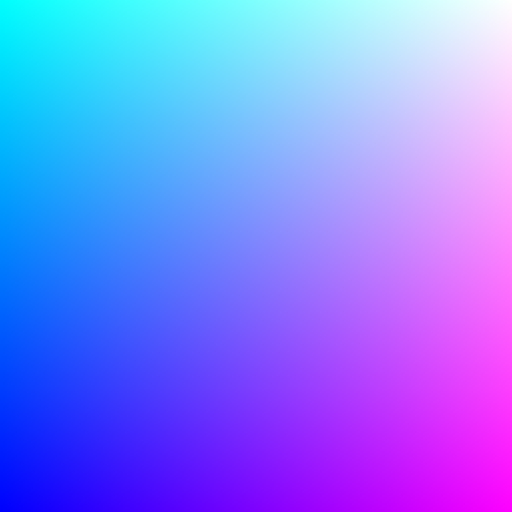

座標を正規化し、0.0 〜 1.0 の範囲に収まるように変換する。

> [preview](http://goo.gl/KcP28e)

```
precision mediump float;
uniform vec2  resolution;    // resolution (512.0, 512.0)
uniform vec2  mouse;         // mouse      (-1.0 ~ 1.0)
uniform float time;          // time       (1second == 1.0)
uniform sampler2D prevScene; // previous scene texture

// 座標を正規化する
void main(){
	vec2 p = gl_FragCoord.xy / resolution;
	gl_FragColor = vec4(p, 1.0, 1.0);
}
```


## sample_06.frag

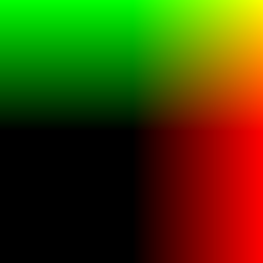

座標を正規化し、-1.0 〜 1.0 の範囲に収まるように変換する。

こうすることで、スクリーンの中央が原点となる座標系が作れる。

> [preview](http://goo.gl/EAHcXX)

```
precision mediump float;
uniform vec2  resolution;    // resolution (512.0, 512.0)
uniform vec2  mouse;         // mouse      (-1.0 ~ 1.0)
uniform float time;          // time       (1second == 1.0)
uniform sampler2D prevScene; // previous scene texture

// 座標を正規化し原点を中心に置く
void main(){
	vec2 p = (gl_FragCoord.xy * 2.0 - resolution) / resolution;
	gl_FragColor = vec4(p, 0.0, 1.0);
}
```


## sample_07.frag

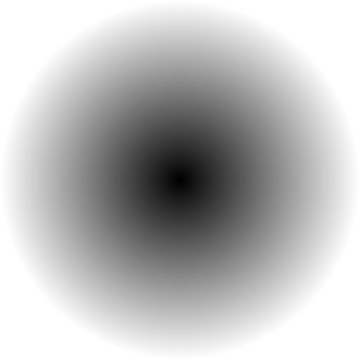

`length`を使うとベクトルの長さを調べることができる。

原点が中央になっていれば、四隅に向かって徐々に大きな値になっていく。

> [preview](http://goo.gl/dCo2Pw)

```
precision mediump float;
uniform vec2  resolution;    // resolution (512.0, 512.0)
uniform vec2  mouse;         // mouse      (-1.0 ~ 1.0)
uniform float time;          // time       (1second == 1.0)
uniform sampler2D prevScene; // previous scene texture

// 各ピクセルの原点からの距離を計測し色として出力する
void main(){
	vec2 p = (gl_FragCoord.xy * 2.0 - resolution) / resolution;
	gl_FragColor = vec4(vec3(length(p)), 1.0);
}
```


## sample_08.frag


除算処理をうまく利用し、強い光のような表現を行う。

なぜ明るい色になるのかを考える場合は、できる限りシンプルに仮説を立てながら考えるのが吉。

> [preview](http://goo.gl/hJHJri)

```
precision mediump float;
uniform vec2  resolution;    // resolution (512.0, 512.0)
uniform vec2  mouse;         // mouse      (-1.0 ~ 1.0)
uniform float time;          // time       (1second == 1.0)
uniform sampler2D prevScene; // previous scene texture

// 強い光のような表現を行う一例
void main(){
	vec2 p = (gl_FragCoord.xy * 2.0 - resolution) / resolution;
	float len = length(p);
	float light = 0.1 / len;
	gl_FragColor = vec4(vec3(light), 1.0);
}
```


## sample_09.frag

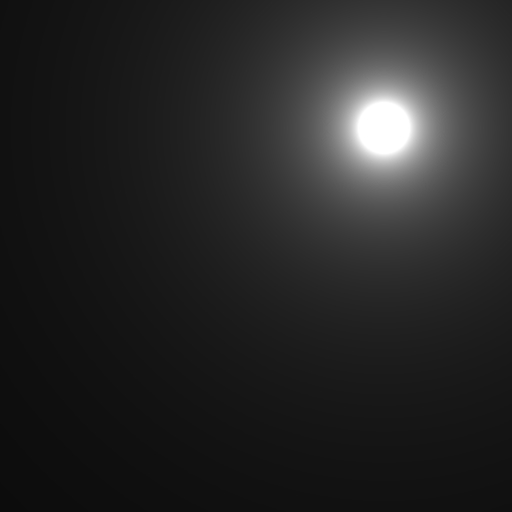

関数定義を利用して光の玉の描画を行いやすくする。

オフセット座標を指定すると任意の座標に移動させられるように設計。

> [preview](http://goo.gl/8jaorg)

```
precision mediump float;
uniform vec2  resolution;    // resolution (512.0, 512.0)
uniform vec2  mouse;         // mouse      (-1.0 ~ 1.0)
uniform float time;          // time       (1second == 1.0)
uniform sampler2D prevScene; // previous scene texture

// 光の玉を出すための明るさ計算用関数
float orb(vec2 position, vec2 offset){
	vec2 q = position - offset;
	float len = length(q);
	return 0.1 / len;
}

// 明るさの計算を外部に切り出し、オフセットで移動させられるようにする
void main(){
	vec2 p = (gl_FragCoord.xy * 2.0 - resolution) / resolution;
	float light = orb(p, vec2(0.5, 0.5));
	gl_FragColor = vec4(vec3(light), 1.0);
}
```


## sample_10.frag


時間の経過に応じて描画結果に変化を加えるために`time`を利用する。

サイン・コサインを使って光の玉を移動させる。

> [preview](http://goo.gl/jio04I)

```
precision mediump float;
uniform vec2  resolution;    // resolution (512.0, 512.0)
uniform vec2  mouse;         // mouse      (-1.0 ~ 1.0)
uniform float time;          // time       (1second == 1.0)
uniform sampler2D prevScene; // previous scene texture

// 光の玉を出すための明るさ計算用関数
float orb(vec2 position, vec2 offset){
	vec2 q = position - offset;
	float len = length(q);
	return 0.1 / len;
}

// 時間の経過によって動くようにしてみる
void main(){
	vec2 p = (gl_FragCoord.xy * 2.0 - resolution) / resolution;
	vec2 offset = vec2(cos(time), sin(time));
	float light = orb(p, offset);
	gl_FragColor = vec4(vec3(light), 1.0);
}
```


## sample_11.frag

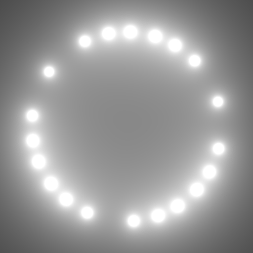

ループ構文を使って光の玉を複製する。

ループを記述する際は、ループ構文の細かな制限に気をつけること。

* 初期化時に不定の値を組み込めない
* 比較演算子の記述に注意
* 整数型なのか浮動小数点型なのかに注意する

> [preview](http://goo.gl/jf1T4g)

```
precision mediump float;
uniform vec2  resolution;    // resolution (512.0, 512.0)
uniform vec2  mouse;         // mouse      (-1.0 ~ 1.0)
uniform float time;          // time       (1second == 1.0)
uniform sampler2D prevScene; // previous scene texture

// 光の玉を出すための明るさ計算用関数
float orb(vec2 position, vec2 offset){
	vec2 q = position - offset;
	float len = length(q);
	return 0.02 / len;
}

// ループ構文を使って光の玉の数を増やす
void main(){
	vec2 p = (gl_FragCoord.xy * 2.0 - resolution) / resolution;
	float light = 0.0;
	for(int i = 1; i <= 20; ++i){
		float f = float(i) * 0.25;
		vec2 offset = vec2(cos(time * f), sin(time * f)) * 0.75;
		light += orb(p, offset);
	}
	gl_FragColor = vec4(vec3(light), 1.0);
}
```


## sample_12.frag


HSV 色空間を利用して、光の玉に着色する。

RGB 色空間とは違い、HSV 色空間は色がループするため非常に色付けがやりやすい。

> [preview](http://goo.gl/AGrwJC)

```
precision mediump float;
uniform vec2  resolution;    // resolution (512.0, 512.0)
uniform vec2  mouse;         // mouse      (-1.0 ~ 1.0)
uniform float time;          // time       (1second == 1.0)
uniform sampler2D prevScene; // previous scene texture

// hsv 色空間による色の生成
vec3 hsv(float h, float s, float v){
	vec4 t = vec4(1.0, 2.0 / 3.0, 1.0 / 3.0, 3.0);
	vec3 p = abs(fract(vec3(h) + t.xyz) * 6.0 - vec3(t.w));
	return v * mix(vec3(t.x), clamp(p - vec3(t.x), 0.0, 1.0), s);
}

// 光の玉を出すための明るさ計算用関数
float orb(vec2 position, vec2 offset){
	vec2 q = position - offset;
	float len = length(q);
	return 0.02 / len;
}

// 光の玉をカラフルに色付ける
void main(){
	vec2 p = (gl_FragCoord.xy * 2.0 - resolution) / resolution;
	vec3 light = vec3(0.0);
	for(int i = 1; i <= 20; ++i){
		// HSV 色空間による計算のために Hue を求める
		float hue = (1.0 / 20.0) * float(i);

		// HSV で色を取得
		vec3 color = hsv(hue, 1.0, 1.0);

		// 明るさを計算
		float f = float(i) * 0.25;
		vec2 offset = vec2(cos(time * f), sin(time * f)) * 0.75;

		// 明るさに色を掛け合わせ加算合成する
		light += color * orb(p, offset);
	}
	gl_FragColor = vec4(light, 1.0);
}
```


## sample_13.frag


今度は光のラインに挑戦。

考え方は玉の場合と似ているので落ち着いて考えよう。

> [preview](http://goo.gl/WF6GHx)

```
precision mediump float;
uniform vec2  resolution;    // resolution (512.0, 512.0)
uniform vec2  mouse;         // mouse      (-1.0 ~ 1.0)
uniform float time;          // time       (1second == 1.0)
uniform sampler2D prevScene; // previous scene texture

// 光のラインを引く
void main(){
	vec2 p = (gl_FragCoord.xy * 2.0 - resolution) / resolution;
	float l = 0.01 / abs(p.y);
	gl_FragColor = vec4(vec3(l), 1.0);
}
```


## sample_14.frag


サインをうまく利用すると、-1.0 から 1.0 の範囲の反復する値を得ることができる。

これを使ってラインを波打たせ、サイン波にする。

> [preview](http://goo.gl/7E2ZHO)

```
precision mediump float;
uniform vec2  resolution;    // resolution (512.0, 512.0)
uniform vec2  mouse;         // mouse      (-1.0 ~ 1.0)
uniform float time;          // time       (1second == 1.0)
uniform sampler2D prevScene; // previous scene texture

// 光のラインをサイン波にする
void main(){
	vec2 p = (gl_FragCoord.xy * 2.0 - resolution) / resolution;
	float l = 0.01 / abs(p.y + sin(p.x * 5.0) * 0.5);
	gl_FragColor = vec4(vec3(l), 1.0);
}
```


## sample_15.frag


時間の経過をサイン波に組み込めば、ラインが動き出す。

> [preview](http://goo.gl/9XQrKQ)

```
precision mediump float;
uniform vec2  resolution;    // resolution (512.0, 512.0)
uniform vec2  mouse;         // mouse      (-1.0 ~ 1.0)
uniform float time;          // time       (1second == 1.0)
uniform sampler2D prevScene; // previous scene texture

// 光のラインをサイン波を動かす
void main(){
	vec2 p = (gl_FragCoord.xy * 2.0 - resolution) / resolution;
	float l = 0.01 / abs(p.y + sin((p.x - time) * 5.0) * 0.5);
	gl_FragColor = vec4(vec3(l), 1.0);
}
```


## sample_16.frag


サイン波を応用して、着色やよりダイナミックな動きをつけたもの。

まるで光の網目のようなものが折り重なる。

> [preview](http://goo.gl/rjVjGO)

```
precision mediump float;
uniform vec2  resolution;    // resolution (512.0, 512.0)
uniform vec2  mouse;         // mouse      (-1.0 ~ 1.0)
uniform float time;          // time       (1second == 1.0)
uniform sampler2D prevScene; // previous scene texture

// hsv 色空間による色の生成
vec3 hsv(float h, float s, float v){
	vec4 t = vec4(1.0, 2.0 / 3.0, 1.0 / 3.0, 3.0);
	vec3 p = abs(fract(vec3(h) + t.xyz) * 6.0 - vec3(t.w));
	return v * mix(vec3(t.x), clamp(p - vec3(t.x), 0.0, 1.0), s);
}

// サイン波生成用
float sineLine(vec2 position, float speed, float offset){
	return 0.005 / abs(position.y + sin(((position.x - offset * time * 0.2) - time * speed) * 5.0) * 0.75);
}

// サイン波で光の網目を描く
void main(){
	vec2 p = (gl_FragCoord.xy * 2.0 - resolution) / resolution;
	vec3 light = vec3(0.0);
	for(int i = 0; i < 16; ++i){
		vec3 color = hsv(float(i) / 16.0, 1.0, 1.0);
		light += color * sineLine(p, 0.5, 6.28 / 16.0 * float(i));
	}
	gl_FragColor = vec4(vec3(light), 1.0);
}
```


## sample_17.frag

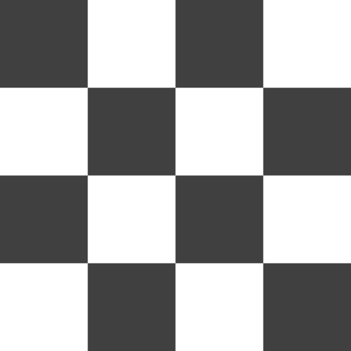

`mod`関数をうまく利用してタイル模様を生成する。

> [preview](http://goo.gl/IXKTNU)

```
precision mediump float;
uniform vec2  resolution;    // resolution (512.0, 512.0)
uniform vec2  mouse;         // mouse      (-1.0 ~ 1.0)
uniform float time;          // time       (1second == 1.0)
uniform sampler2D prevScene; // previous scene texture

// タイル模様を生成する
void main(){
	vec2 p = (gl_FragCoord.xy * 2.0 - resolution) / resolution;
	float tile = 1.0;
	if(
		(mod(p.x, 1.0) > 0.5 && mod(p.y, 1.0) < 0.5) ||
		(mod(p.x, 1.0) < 0.5 && mod(p.y, 1.0) > 0.5)
	){
		tile = 0.25;
	}
	gl_FragColor = vec4(vec3(tile), 1.0);
}
```


## sample_18.frag

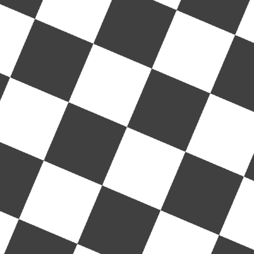

行列を使って座標を回転させる簡単なサンプル。

> [preview](http://goo.gl/8VWvAl)

```
precision mediump float;
uniform vec2  resolution;    // resolution (512.0, 512.0)
uniform vec2  mouse;         // mouse      (-1.0 ~ 1.0)
uniform float time;          // time       (1second == 1.0)
uniform sampler2D prevScene; // previous scene texture

// タイル模様を生成する
void main(){
	vec2 p = (gl_FragCoord.xy * 2.0 - resolution) / resolution;

	// 回転行列を生成する
	float s = sin(time);
	float c = cos(time);
	mat2 m = mat2(c, s, -s, c);

	// 座標を行列で回転させる
	vec2 q = m * p;

	float tile = 1.0;
	if(
		(mod(q.x, 1.0) > 0.5 && mod(q.y, 1.0) < 0.5) ||
		(mod(q.x, 1.0) < 0.5 && mod(q.y, 1.0) > 0.5)
	){
		tile = 0.25;
	}
	gl_FragColor = vec4(vec3(tile), 1.0);
}
```


## sample_19.frag


目……目が回るううう〜

（タイル回転の応用ワザ）

> [preview](http://goo.gl/2rcwRa)

```
precision mediump float;
uniform vec2  resolution;    // resolution (512.0, 512.0)
uniform vec2  mouse;         // mouse      (-1.0 ~ 1.0)
uniform float time;          // time       (1second == 1.0)
uniform sampler2D prevScene; // previous scene texture

// タイル模様を生成する
void main(){
	vec2 p = (gl_FragCoord.xy * 2.0 - resolution) / resolution;

	// 回転行列を生成する
	float s = sin(time);
	float c = cos(time);
	mat2 m = mat2(c, s, -s, c);

	// 座標を行列で回転させる
	vec2 q = m * (p + sin(time)) * 5.0;

	float tile = 1.0;
	if(
		(mod(q.x, 1.0) > 0.5 && mod(q.y, 1.0) < 0.5) ||
		(mod(q.x, 1.0) < 0.5 && mod(q.y, 1.0) > 0.5)
	){
		tile = 0.25;
	}
	gl_FragColor = vec4(vec3(tile), 1.0);
}
```


## sample_20.frag

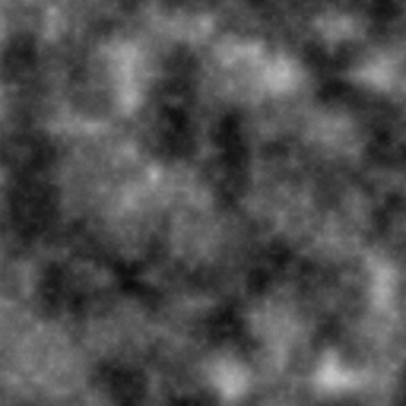

ノイズを生成して描画する。

> [preview](http://goo.gl/kFUUWs)

```
precision mediump float;
uniform vec2  resolution;    // resolution (512.0, 512.0)
uniform vec2  mouse;         // mouse      (-1.0 ~ 1.0)
uniform float time;          // time       (1second == 1.0)
uniform sampler2D prevScene; // previous scene texture

// noise =========================================================
float rnd(vec2 n) {
	return fract(sin(dot(n, vec2(12.9898, 4.1414))) * 43758.5453);
}
float noise(vec2 p){
	vec2 v = floor(p);
	vec2 u = fract(p);
	u = u * u * (3.0 - 2.0 * u);
	float r = mix(
		mix(rnd(v), rnd(v + vec2(1.0, 0.0)), u.x),
		mix(rnd(v + vec2(0.0, 1.0)), rnd(v + vec2(1.0, 1.0)), u.x),
		u.y
	);
	return r * r;
}
float snoise(vec2 p){
	float n = 0.0;
	for(float i = 0.0; i < 6.0; ++i){
		float v = pow(2.0, 2.0 + i);
		float w = pow(2.0, -1.0 - i);
		n += noise(p * v) * w;
	}
	return n;
}
// ===============================================================

// ノイズで模様を描画する
void main(){
	vec2 p = (gl_FragCoord.xy * 2.0 - resolution) / resolution;
	float n = snoise(p + time * 0.1);
	gl_FragColor = vec4(vec3(n), 1.0);
}
```


## sample_21.frag

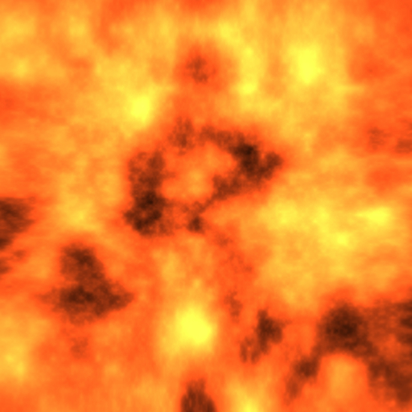

ノイズを使って激しく燃え盛る炎を表現してみる。

歪ませると着色すること、このふたつだけでも一気に炎らしくなる。

> [preview](http://goo.gl/ojRj2L)

```
precision mediump float;
uniform vec2  resolution;    // resolution (512.0, 512.0)
uniform vec2  mouse;         // mouse      (-1.0 ~ 1.0)
uniform float time;          // time       (1second == 1.0)
uniform sampler2D prevScene; // previous scene texture

// noise =========================================================
float rnd(vec2 n) {
	return fract(sin(dot(n, vec2(12.9898, 4.1414))) * 43758.5453);
}
float noise(vec2 p){
	vec2 v = floor(p);
	vec2 u = fract(p);
	u = u * u * (3.0 - 2.0 * u);
	float r = mix(
		mix(rnd(v), rnd(v + vec2(1.0, 0.0)), u.x),
		mix(rnd(v + vec2(0.0, 1.0)), rnd(v + vec2(1.0, 1.0)), u.x),
		u.y
	);
	return r * r;
}
float snoise(vec2 p){
	float n = 0.0;
	for(float i = 0.0; i < 6.0; ++i){
		float v = pow(2.0, 2.0 + i);
		float w = pow(2.0, -1.0 - i);
		n += noise(p * v) * w;
	}
	return n;
}
// ===============================================================

// 炎の色
const vec3 fireColor = vec3(0.9, 0.3, 0.1);

// ノイズで模様を描画する
void main(){
	vec2 p = (gl_FragCoord.xy * 2.0 - resolution) / resolution;

	// アークタンジェントを使って座標を歪める
	vec2 q = atan(p);

	// 歪めた座標を移動させながらノイズを生成
	float n = snoise(q + time * 2.0) * 5.0;

	gl_FragColor = vec4(fireColor * n, 1.0);
}
```


## sample_22.frag

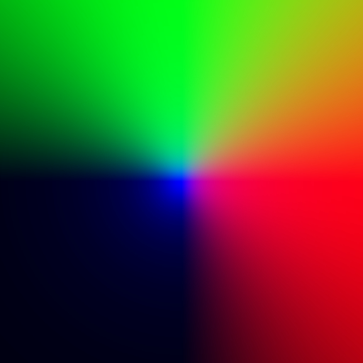

三次元空間をシェーダ内だけで定義する。

カメラ、そしてレイのふたつを定義し座標系を三次元にする。

> [preview](http://goo.gl/iM1ktD)

```
precision mediump float;
uniform vec2  resolution;    // resolution (512.0, 512.0)
uniform vec2  mouse;         // mouse      (-1.0 ~ 1.0)
uniform float time;          // time       (1second == 1.0)
uniform sampler2D prevScene; // previous scene texture

void main(){
	vec2 p = (gl_FragCoord.xy * 2.0 - resolution) / min(resolution.x, resolution.y);

	// カメラを定義する
	vec3 cPos = vec3(0.0,  0.0,  3.0); // カメラの位置
	vec3 cDir = vec3(0.0,  0.0, -1.0); // カメラの向き(視線)
	vec3 cUp  = vec3(0.0,  1.0,  0.0); // カメラの上方向
	vec3 cSide = cross(cDir, cUp);	 // 外積を使って横方向を算出
	float targetDepth = 0.1;		   // フォーカスする深度

	// カメラの情報からレイを定義する
	vec3 ray = normalize(cSide * p.x + cUp * p.y + cDir * targetDepth);

	// レイをそのまま色として出力
	gl_FragColor = vec4(ray.xy, -ray.z, 1.0);
}
```


## sample_23.frag


distance function を定義して、球体との衝突判定を行う。

レイの先端とオブジェクトとの間の距離が十分に小さい場合を衝突とみなす。

> [preview](http://goo.gl/qG1xEj)

```
precision mediump float;
uniform vec2  resolution;    // resolution (512.0, 512.0)
uniform vec2  mouse;         // mouse      (-1.0 ~ 1.0)
uniform float time;          // time       (1second == 1.0)
uniform sampler2D prevScene; // previous scene texture

// distance function
float sphere(vec3 p){
	return length(p) - 1.0;
}

void main(){
	vec2 p = (gl_FragCoord.xy * 2.0 - resolution) / min(resolution.x, resolution.y);

	// カメラを定義する
	vec3 cPos = vec3(0.0,  0.0,  3.0); // カメラの位置
	vec3 cDir = vec3(0.0,  0.0, -1.0); // カメラの向き(視線)
	vec3 cUp  = vec3(0.0,  1.0,  0.0); // カメラの上方向
	vec3 cSide = cross(cDir, cUp);     // 外積を使って横方向を算出
	float targetDepth = 1.0;           // フォーカスする深度

	// カメラの情報からレイを定義する
	vec3 ray = normalize(cSide * p.x + cUp * p.y + cDir * targetDepth);

	// マーチングループを組む
	float dist = 0.0;  // レイとオブジェクト間の最短距離
	float rLen = 0.0;  // レイに継ぎ足す長さ
	vec3  rPos = cPos; // レイの先端位置(初期位置)
	for(int i = 0; i < 32; ++i){
		dist = sphere(rPos);
		rLen += dist;
		rPos = cPos + ray * rLen;
	}

	// レイとオブジェクトの距離を確認
	if(abs(dist) < 0.001){
		gl_FragColor = vec4(vec3(1.0), 1.0);
	}else{
		gl_FragColor = vec4(vec3(0.0), 1.0);
	}
}
```


## sample_24.frag


法線を算出するための関数を追加する。

> [preview](http://goo.gl/t8eg9s)

```
precision mediump float;
uniform vec2  resolution;    // resolution (512.0, 512.0)
uniform vec2  mouse;         // mouse      (-1.0 ~ 1.0)
uniform float time;          // time       (1second == 1.0)
uniform sampler2D prevScene; // previous scene texture

// distance function
float sphere(vec3 p){
	return length(p) - 1.0;
}

vec3 getNormal(vec3 p){
	float d = 0.001;
	return normalize(vec3(
		sphere(p + vec3(  d, 0.0, 0.0)) - sphere(p + vec3( -d, 0.0, 0.0)),
		sphere(p + vec3(0.0,   d, 0.0)) - sphere(p + vec3(0.0,  -d, 0.0)),
		sphere(p + vec3(0.0, 0.0,   d)) - sphere(p + vec3(0.0, 0.0,  -d))
	));
}

void main(){
	vec2 p = (gl_FragCoord.xy * 2.0 - resolution) / min(resolution.x, resolution.y);

	// カメラを定義する
	vec3 cPos = vec3(0.0,  0.0,  3.0); // カメラの位置
	vec3 cDir = vec3(0.0,  0.0, -1.0); // カメラの向き(視線)
	vec3 cUp  = vec3(0.0,  1.0,  0.0); // カメラの上方向
	vec3 cSide = cross(cDir, cUp);     // 外積を使って横方向を算出
	float targetDepth = 1.0;           // フォーカスする深度

	// カメラの情報からレイを定義する
	vec3 ray = normalize(cSide * p.x + cUp * p.y + cDir * targetDepth);

	// マーチングループを組む
	float dist = 0.0;  // レイとオブジェクト間の最短距離
	float rLen = 0.0;  // レイに継ぎ足す長さ
	vec3  rPos = cPos; // レイの先端位置(初期位置)
	for(int i = 0; i < 32; ++i){
		dist = sphere(rPos);
		rLen += dist;
		rPos = cPos + ray * rLen;
	}

	// レイとオブジェクトの距離を確認
	if(abs(dist) < 0.001){
		// 法線を算出
		vec3 normal = getNormal(rPos);
		gl_FragColor = vec4(normal, 1.0);
	}else{
		gl_FragColor = vec4(vec3(0.0), 1.0);
	}
}
```


## sample_25.frag


法線が算出できたので、その情報を元にライティングを行う。

> [preview](http://goo.gl/T46Esr)

```
precision mediump float;
uniform vec2  resolution;    // resolution (512.0, 512.0)
uniform vec2  mouse;         // mouse      (-1.0 ~ 1.0)
uniform float time;          // time       (1second == 1.0)
uniform sampler2D prevScene; // previous scene texture

// distance function
float sphere(vec3 p){
	return length(p) - 1.0;
}

// normal
vec3 getNormal(vec3 p){
	float d = 0.001;
	return normalize(vec3(
		sphere(p + vec3(  d, 0.0, 0.0)) - sphere(p + vec3( -d, 0.0, 0.0)),
		sphere(p + vec3(0.0,   d, 0.0)) - sphere(p + vec3(0.0,  -d, 0.0)),
		sphere(p + vec3(0.0, 0.0,   d)) - sphere(p + vec3(0.0, 0.0,  -d))
	));
}

void main(){
	vec2 p = (gl_FragCoord.xy * 2.0 - resolution) / min(resolution.x, resolution.y);

	// カメラを定義する
	vec3 cPos = vec3(0.0,  0.0,  3.0); // カメラの位置
	vec3 cDir = vec3(0.0,  0.0, -1.0); // カメラの向き(視線)
	vec3 cUp  = vec3(0.0,  1.0,  0.0); // カメラの上方向
	vec3 cSide = cross(cDir, cUp);     // 外積を使って横方向を算出
	float targetDepth = 1.0;           // フォーカスする深度

	// カメラの情報からレイを定義する
	vec3 ray = normalize(cSide * p.x + cUp * p.y + cDir * targetDepth);

	// マーチングループを組む
	float dist = 0.0;  // レイとオブジェクト間の最短距離
	float rLen = 0.0;  // レイに継ぎ足す長さ
	vec3  rPos = cPos; // レイの先端位置(初期位置)
	for(int i = 0; i < 32; ++i){
		dist = sphere(rPos);
		rLen += dist;
		rPos = cPos + ray * rLen;
	}

	// レイとオブジェクトの距離を確認
	if(abs(dist) < 0.001){
		// 法線を算出
		vec3 normal = getNormal(rPos);

		// ライトベクトルとの内積を取る
		float diff = max(dot(normal, normalize(vec3(1.0))), 0.1);

		gl_FragColor = vec4(vec3(diff), 1.0);
	}else{
		gl_FragColor = vec4(vec3(0.0), 1.0);
	}
}
```


## sample_26.frag


座標系を複製することでオブジェクトをたくさん描画する。

> [preview](http://goo.gl/blShKO)

```
precision mediump float;
uniform vec2  resolution;    // resolution (512.0, 512.0)
uniform vec2  mouse;         // mouse      (-1.0 ~ 1.0)
uniform float time;          // time       (1second == 1.0)
uniform sampler2D prevScene; // previous scene texture

// repetition
vec3 trans(vec3 p){
	return mod(p, 4.0) - 2.0;
}

// distance function
float sphere(vec3 p){
	return length(trans(p)) - 1.0;
}

// normal
vec3 getNormal(vec3 p){
	float d = 0.001;
	return normalize(vec3(
		sphere(p + vec3(  d, 0.0, 0.0)) - sphere(p + vec3( -d, 0.0, 0.0)),
		sphere(p + vec3(0.0,   d, 0.0)) - sphere(p + vec3(0.0,  -d, 0.0)),
		sphere(p + vec3(0.0, 0.0,   d)) - sphere(p + vec3(0.0, 0.0,  -d))
	));
}

void main(){
	vec2 p = (gl_FragCoord.xy * 2.0 - resolution) / min(resolution.x, resolution.y);

	// カメラを定義する
	vec3 cPos = vec3(0.0,  0.0,  3.0); // カメラの位置
	vec3 cDir = vec3(0.0,  0.0, -1.0); // カメラの向き(視線)
	vec3 cUp  = vec3(0.0,  1.0,  0.0); // カメラの上方向
	vec3 cSide = cross(cDir, cUp);     // 外積を使って横方向を算出
	float targetDepth = 1.0;           // フォーカスする深度

	// カメラの情報からレイを定義する
	vec3 ray = normalize(cSide * p.x + cUp * p.y + cDir * targetDepth);

	// マーチングループを組む
	float dist = 0.0;  // レイとオブジェクト間の最短距離
	float rLen = 0.0;  // レイに継ぎ足す長さ
	vec3  rPos = cPos; // レイの先端位置(初期位置)
	for(int i = 0; i < 64; ++i){
		dist = sphere(rPos);
		rLen += dist;
		rPos = cPos + ray * rLen;
	}

	// レイとオブジェクトの距離を確認
	if(abs(dist) < 0.001){
		// 法線を算出
		vec3 normal = getNormal(rPos);

		// ライトベクトルとの内積を取る
		float diff = max(dot(normal, normalize(vec3(1.0))), 0.1);

		gl_FragColor = vec4(vec3(diff), 1.0);
	}else{
		gl_FragColor = vec4(vec3(0.0), 1.0);
	}
}
```


## sample_27.frag


カメラを動くようにし、さらに距離に応じて暗くなるようなエフェクトを追加する。

> [preview](http://goo.gl/XGISgP)

```
precision mediump float;
uniform vec2  resolution;    // resolution (512.0, 512.0)
uniform vec2  mouse;         // mouse      (-1.0 ~ 1.0)
uniform float time;          // time       (1second == 1.0)
uniform sampler2D prevScene; // previous scene texture

// repetition
vec3 trans(vec3 p){
	return mod(p, 4.0) - 2.0;
}

// distance function
float sphere(vec3 p){
	return length(trans(p)) - 1.0;
}

// normal
vec3 getNormal(vec3 p){
	float d = 0.001;
	return normalize(vec3(
		sphere(p + vec3(  d, 0.0, 0.0)) - sphere(p + vec3( -d, 0.0, 0.0)),
		sphere(p + vec3(0.0,   d, 0.0)) - sphere(p + vec3(0.0,  -d, 0.0)),
		sphere(p + vec3(0.0, 0.0,   d)) - sphere(p + vec3(0.0, 0.0,  -d))
	));
}

void main(){
	vec2 p = (gl_FragCoord.xy * 2.0 - resolution) / min(resolution.x, resolution.y);

	// カメラを定義する
	vec3 cPos = vec3(0.0,  0.0,  3.0); // カメラの位置

	// カメラの位置を時間経過によって動かす
	cPos += vec3(cos(time) * 1.25, sin(time) * 0.75, sin(time * 0.5));

	vec3 cDir = vec3(0.0,  0.0, -1.0); // カメラの向き(視線)
	vec3 cUp  = vec3(0.0,  1.0,  0.0); // カメラの上方向
	vec3 cSide = cross(cDir, cUp);     // 外積を使って横方向を算出
	float targetDepth = 1.0;           // フォーカスする深度

	// カメラの情報からレイを定義する
	vec3 ray = normalize(cSide * p.x + cUp * p.y + cDir * targetDepth);

	// マーチングループを組む
	float dist = 0.0;  // レイとオブジェクト間の最短距離
	float rLen = 0.0;  // レイに継ぎ足す長さ
	vec3  rPos = cPos; // レイの先端位置(初期位置)
	for(int i = 0; i < 128; ++i){
		dist = sphere(rPos);
		rLen += dist;
		rPos = cPos + ray * rLen;
	}

	// レイとオブジェクトの距離を確認
	if(abs(dist) < 0.001){
		// 法線を算出
		vec3 normal = getNormal(rPos);

		// ライトベクトルとの内積を取る
		float diff = max(dot(normal, normalize(vec3(1.0))), 0.1);

		// カメラからオブジェクトのまでの距離に応じて暗くする
		float dark = min(10.0 / length(rPos), 1.0);

		gl_FragColor = vec4(vec3(diff) * dark, 1.0);
	}else{
		gl_FragColor = vec4(vec3(0.0), 1.0);
	}
}
```


## sample_28.frag

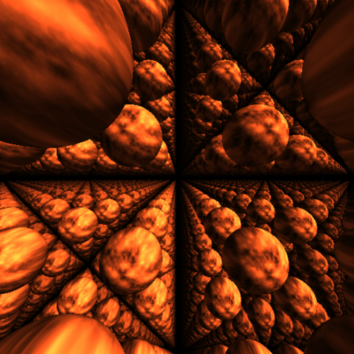

二次元的に生成した炎模様をテクスチャのように使い、球体に貼り付ける。
法線というテクスチャ座標の代わりになる情報があるのでこんなこともできるという一例。

> [preview](http://goo.gl/oSA2Uu)

```
precision mediump float;
uniform vec2  resolution;    // resolution (512.0, 512.0)
uniform vec2  mouse;         // mouse      (-1.0 ~ 1.0)
uniform float time;          // time       (1second == 1.0)
uniform sampler2D prevScene; // previous scene texture

// noise =========================================================
float rnd(vec2 n) {
	return fract(sin(dot(n, vec2(12.9898, 4.1414))) * 43758.5453);
}
float noise(vec2 p){
	vec2 v = floor(p);
	vec2 u = fract(p);
	u = u * u * (3.0 - 2.0 * u);
	float r = mix(
		mix(rnd(v), rnd(v + vec2(1.0, 0.0)), u.x),
		mix(rnd(v + vec2(0.0, 1.0)), rnd(v + vec2(1.0, 1.0)), u.x),
		u.y
	);
	return r * r;
}
float snoise(vec2 p){
	float n = 0.0;
	for(float i = 0.0; i < 6.0; ++i){
		float v = pow(2.0, 2.0 + i);
		float w = pow(2.0, -1.0 - i);
		n += noise(p * v) * w;
	}
	return n;
}
// ===============================================================

// 炎の色
const vec3 fireColor = vec3(0.9, 0.3, 0.1);

// repetition
vec3 trans(vec3 p){
	return mod(p, 4.0) - 2.0;
}

// distance function
float sphere(vec3 p){
	return length(trans(p)) - 1.0;
}

// normal
vec3 getNormal(vec3 p){
	float d = 0.001;
	return normalize(vec3(
		sphere(p + vec3(  d, 0.0, 0.0)) - sphere(p + vec3( -d, 0.0, 0.0)),
		sphere(p + vec3(0.0,   d, 0.0)) - sphere(p + vec3(0.0,  -d, 0.0)),
		sphere(p + vec3(0.0, 0.0,   d)) - sphere(p + vec3(0.0, 0.0,  -d))
	));
}

void main(){
	vec2 p = (gl_FragCoord.xy * 2.0 - resolution) / min(resolution.x, resolution.y);

	// カメラを定義する
	vec3 cPos = vec3(0.0,  0.0,  3.0); // カメラの位置
	cPos += vec3(cos(time) * 1.25, sin(time) * 0.75, sin(time * 0.5));
	vec3 cDir = vec3(0.0,  0.0, -1.0); // カメラの向き(視線)
	vec3 cUp  = vec3(0.0,  1.0,  0.0); // カメラの上方向
	vec3 cSide = cross(cDir, cUp);     // 外積を使って横方向を算出
	float targetDepth = 1.0;           // フォーカスする深度

	// カメラの情報からレイを定義する
	vec3 ray = normalize(cSide * p.x + cUp * p.y + cDir * targetDepth);

	// マーチングループを組む
	float dist = 0.0;  // レイとオブジェクト間の最短距離
	float rLen = 0.0;  // レイに継ぎ足す長さ
	vec3  rPos = cPos; // レイの先端位置(初期位置)
	for(int i = 0; i < 128; ++i){
		dist = sphere(rPos);
		rLen += dist;
		rPos = cPos + ray * rLen;
	}

	// レイとオブジェクトの距離を確認
	if(abs(dist) < 0.001){
		// 法線を算出
		vec3 normal = getNormal(rPos);

		// 法線からノイズを生成
		float n = snoise(normal.xy + time) * 5.0;
		vec4 fire = vec4(fireColor * n, 1.0);

		// ライトベクトルとの内積を取る
		float diff = max(dot(normal, normalize(vec3(1.0))), 0.1);

		// カメラからオブジェクトのまでの距離に応じて暗くする
		float dark = min(10.0 / length(rPos), 1.0);

		// 最終的に出力する色に炎の色を乗算する
		gl_FragColor = vec4(vec3(diff) * dark, 1.0) * fire;
	}else{
		gl_FragColor = vec4(vec3(0.0), 1.0);
	}
}
```


